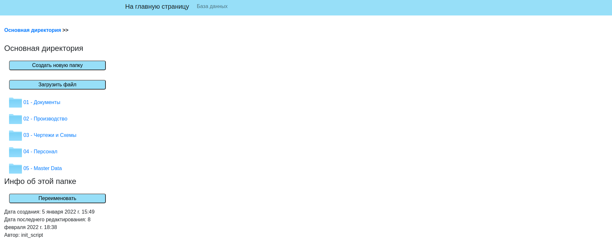
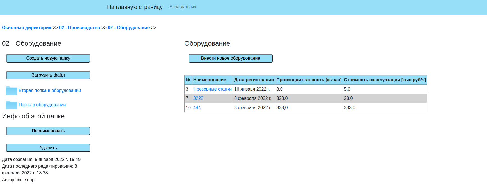
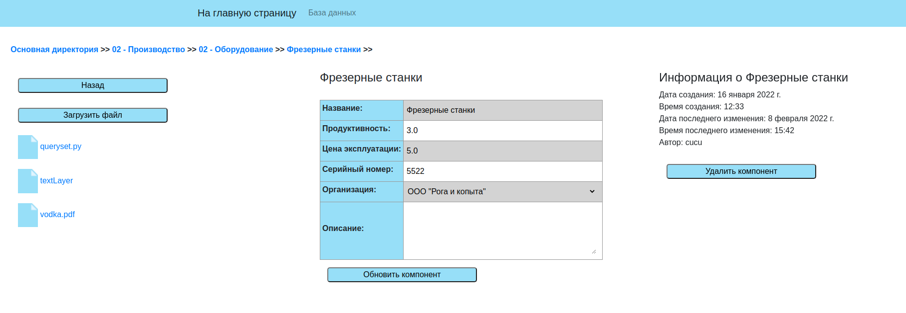

# Сайт для документооборота на предприятии

Проект представляет собой онлайн базу данных с имплементированной файловой системой и визуализацией данных на вэб сайте. 

Приложение general - основной поставщих структурных блоков на сайте и файловой системы;
приложение tables - набор методов для презентации данных и их структуры.

Данное приложение предназначено для ведения документооборота на предприятии.

